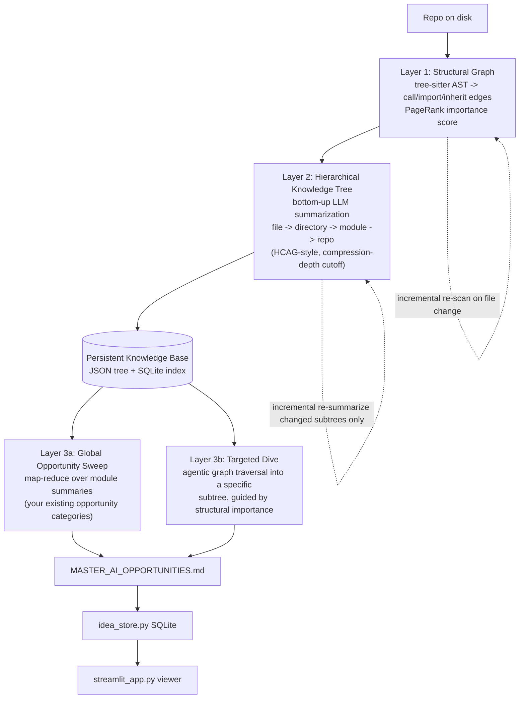

# Agent Brief: AI Opportunity Scanner v2 — Persistent Knowledge Tree + Opportunity Mining

## 0. Context for the agent

You are extending an existing working tool: the **AI Opportunity Scanner**, which scans a multi-module
Java/Spring repository, chunks source files, calls an LLM, and generates per-module + master
"AI/ML opportunity" reports (e.g. spotting recommendation hooks, fraud/risk rule engines that could
become ML models, static disclosure templates ripe for GenAI personalization, etc.). There's also an
`idea_store.py` (SQLite importer for parsed ideas) and a `streamlit_app.py` viewer.

**The core problem with v1:** every scan re-derives understanding of the repo from raw chunked source.
There's no persistent memory of the codebase between runs, chunking is arbitrary (`MAX_CHARS_PER_CALL`),
and the LLM never sees repo-wide structure — only whatever fits in the current chunk.

**The fix:** decouple "understanding the repo" from "mining it for ideas." Build a persistent,
incrementally-updatable **knowledge tree** once; mine it for opportunities (cheaply, repeatedly,
at multiple zoom levels) afterward. This is the same separation PageIndex makes for documents
(build the tree once, reason over it at query time) — applied to a codebase instead of a PDF.

This document is both a **research brief** (Section 1 — validate/deepen before building) and an
**implementation plan** (Sections 2–5 — build after validating).

---

## 1. Research to validate/deepen first

Before writing code, read these primary sources. They represent four different schools of thought
on repo-level code representation — pick the right pieces from each rather than committing to one.

| Approach | What to read | Why it matters here |
|---|---|---|
| **Deterministic structural graph (no LLM)** | Aider's repo-map: https://aider.chat/docs/repomap.html and https://aider.chat/2023/10/22/repomap.html | tree-sitter AST → call/import graph → PageRank ranking. Free signal for "what's architecturally central" before spending a single LLM token. |
| **Hierarchical bottom-up LLM summarization (PageIndex's approach, applied to code)** | arXiv 2603.20299 "HCAG: Hierarchical Abstraction and Retrieval-Augmented Generation on Theoretical Repositories with LLMs" | Near-exact blueprint: leaf files → file summaries → directory summaries → module summaries → repo summary, recursively, with a **compression-depth parameter** that defers detail on huge subtrees (placeholder + on-demand expansion). This directly solves your `MAX_CHARS_PER_CALL` cost problem. |
| **Knowledge graph + LLM querying** | arXiv 2410.14684 "RepoGraph"; CodexGraph (Liu et al. 2024); arXiv on KGCompass (repo-aware KG for repair) | Useful if you later want an agent to issue structured queries ("show me all classes that call into the Risk module") rather than just reading flat summaries. |
| **Working reference implementation** | https://github.com/Lum1104/Understand-Anything (read the README's "Under the Hood" multi-agent pipeline section) | Already does "turn any codebase into a JSON knowledge graph + dashboard" with incremental updates and a committable graph artifact. Don't reinvent its node/edge schema from scratch — study it, take what's useful, skip the dashboard/plugin parts you don't need. |
| **Microsoft GraphRAG (for the idea-mining layer's retrieval pattern)** | "From Local to Global: A GraphRAG Approach to Query-Focused Summarization" (arXiv 2404.16130) | Their map-reduce over hierarchical community summaries is a good template for how to ask a *global* question ("what are the top opportunities in this repo?") across a tree too big to fit in one context window. |

**Agent task for this phase:** read the above, then write a 1-page decision memo answering:
1. Structural graph only, summarization tree only, or both layered together? (Recommendation below: both.)
2. SQLite+JSON vs. a real graph DB (Neo4j/Cypher) — justify based on expected repo size and whether
   an agent will need ad-hoc graph queries vs. just reading pre-computed summaries.
3. What's the right compression-depth / token-budget default for a typical multi-module Spring repo?

---

## 2. Proposed architecture

**Why three layers instead of one:**
- Layer 1 is free (no LLM calls) and gives you a ranked sense of what's important before you spend
  any tokens — directly reusable from Aider's open approach.
- Layer 2 is where the actual cost lives. Doing it *once*, bottom-up, and caching it is the entire
  point — your v1 scanner pays this cost on every single run, for every opportunity-mining pass.
- Layer 3 splits into two modes because opportunity mining has two real use patterns: "scan the
  whole repo and tell me everything" (global, map-reduce style) and "I suspect there's something
  in the fraud/risk path specifically, dig there" (targeted, follow the graph).

---

## 3. Concrete implementation plan

### Phase 1 — Structural graph (no LLM, build first, validate independently)
- Use `tree-sitter` (or `py-tree-sitter-languages` for quick multi-language wheels) to parse every
  source file into definitions (`class`, `method`, `field`) and references (`calls`, `imports`, `extends`/`implements`).
- Build a directed graph (use `networkx` for simplicity) — nodes are files/classes/methods, edges are
  references. Run PageRank to get an importance score per node, exactly as Aider does.
- Cache parse results keyed by `(path, mtime)` so re-scans only re-parse changed files.
- **Deliverable:** `structural_graph.py` producing a serializable graph (node list + edge list + PageRank
  scores) as JSON, independent of any LLM call. This alone is useful for prioritizing which files your
  v1 scanner's `--modules` flag should focus on.

### Phase 2 — Hierarchical knowledge tree (LLM-powered, the HCAG-style core)
- Recursive, bottom-up summarization:
  - **Leaf (file) level:** for each source file, prompt the LLM for a structured summary: key
    responsibility, important classes/methods (weighted by Phase 1's PageRank score so the summary
    foregrounds what's actually central), inputs/outputs, notable patterns (rule engines, thresholds,
    static templates, etc. — reuse your existing opportunity-category vocabulary here as hints, not
    conclusions).
  - **Directory/module level:** aggregate child summaries (file or sub-directory) and ask the LLM for
    a module-level summary: overall purpose, architectural role, how it relates to sibling modules.
  - **Repo (root) level:** aggregate module summaries into a repo-level summary.
- **Compression-depth cutoff:** for directories deeper than a configurable threshold `C`, skip detailed
  summarization and instead store a placeholder ("to be detailed") with a pointer to the underlying
  files — expand on demand only if a later opportunity-mining pass actually needs that subtree. This
  is the direct fix for your current `MAX_CHARS_PER_CALL` / cost-control problem: instead of chunking
  blindly, you defer work on low-priority subtrees entirely.
- **Incremental updates:** on a re-scan, only re-summarize files that changed (mtime or git diff), then
  only re-summarize the directory/module/root nodes whose children changed — don't rebuild the whole
  tree every time.
- **Deliverable:** `knowledge_tree_builder.py` producing a tree structure (JSON, similar shape to
  PageIndex's own node format — `title`, `node_id`, `summary`, `children`) plus a SQLite table indexing
  nodes by path/module/PageRank score for fast lookup. This *is* your "knowledge repo base."

### Phase 3 — Opportunity mining (reuses your existing prompt logic, new retrieval pattern)
- **Global sweep mode:** walk the tree top-down. At each module node, feed its summary (not raw
  source) to your existing opportunity-mining prompt (the categories from your current README —
  Personalization, Proactive Intelligence, Natural Language Interfaces, Smart Automation, Risk/Fraud,
  Dynamic Content/GenAI, Accessibility, Model Replacement of Rules Engines, Observability, Domain
  Predictors, Information Extraction). Where a module's summary suggests something concrete (e.g. a
  rules-engine pattern), only then drill into the underlying file-level summaries or raw source for
  specifics and citations — mirroring GraphRAG's map-reduce-over-summaries pattern, so cost scales with
  tree size, not raw file size.
- **Targeted dive mode:** given a user query like "AI opportunities in the fraud/risk path," start at
  the highest-PageRank node matching the query, then follow structural-graph edges (calls/imports) to
  explore neighboring code — closer to RepoUnderstander's "explore the graph, don't re-read everything"
  pattern. Useful as a CLI flag or a Streamlit search box.
- **Deliverable:** refactor `ai_opportunity_scanner.py` so its core loop reads from the knowledge tree +
  structural graph instead of chunking raw files. Per-module and master reports keep the same output
  format you already have (`*_opportunities.md`, `MASTER_AI_OPPORTUNITIES.md`) — this is a backend
  swap, not a UX rewrite.

### Phase 4 — Persistence and reuse
- Commit the knowledge tree JSON (or a compressed/pointer version, à la Understand-Anything's
  git-committed graph) so re-running opportunity mining — or asking a *different* question of the same
  repo later — doesn't require rebuilding the tree from scratch.
- Extend `idea_store.py`'s SQLite schema to also index the knowledge tree nodes (not just the resulting
  ideas), so the Streamlit app can let a user click an opportunity and jump to the module/file summary
  that generated it — full traceability from idea back to source, the way PageIndex traces retrieval
  back to a specific page/section.

---

## 4. Tech stack recommendation (default; agent should confirm with research memo first)

- **Parsing:** `tree-sitter` + `py-tree-sitter-languages` (multi-language wheels, matches Aider's choice).
- **Structural graph:** `networkx` for the in-memory graph + PageRank; no separate graph DB needed at
  this stage.
- **Knowledge tree persistence:** JSON tree (PageIndex-shaped: `node_id`, `title`, `summary`, `start/end`
  pointers into source, `nodes: [...]` for children) + SQLite for indexed lookups (extends your existing
  `idea_store.py` pattern — same database, additional tables).
- **Graph DB upgrade path (optional, later):** only introduce Neo4j/Cypher if you need an agent to issue
  ad-hoc structural queries across a very large multi-repo corpus. Don't start there.
- **LLM calls:** keep your existing provider abstraction (`chat_completion_client.py` / local endpoint
  variant) — this layer doesn't need to change, just what you feed it.

---

## 5. Success criteria

- Re-running opportunity mining on an unchanged repo costs ~0 LLM tokens for the knowledge-tree layer
  (cache hit) — only the mining prompts re-run.
- Re-running after a small code change only re-summarizes the changed file + its ancestor directories/
  module/root, not the whole repo.
- A generated opportunity can be traced back to the specific file/module summary (and PageRank-weighted
  importance) that produced it.
- Per-module opportunity reports read noticeably more "architecturally aware" than v1 (e.g. correctly
  identifying that a `Service` class is central because three `Controller`s depend on it, not because it
  happened to be early in chunking order).

---

## References (for the agent to fetch directly when implementing)

- Aider repo map: https://aider.chat/docs/repomap.html
- HCAG paper: arXiv 2603.20299
- RepoGraph paper: arXiv 2410.14684
- Understand-Anything: https://github.com/Lum1104/Understand-Anything
- GraphRAG (Microsoft, query-focused summarization): arXiv 2404.16130
- RAPTOR (recursive abstractive tree retrieval, general text — origin of the tree-summarization idea): search "RAPTOR recursive abstractive processing tree retrieval"
- Your own PageIndex reference doc (tree structure JSON shape to imitate for the knowledge tree format)